# Fin-Agentix India: Complete Project Plan & Implementation Guide

## 🇮🇳 **PROJECT OVERVIEW - INDIA EDITION**

**Project Name**: Fin-Agentix India - AI-Powered Multi-Sector Lending Platform  
**Target Market**: Indian Financial Services Industry  
**Regulatory Framework**: RBI Guidelines, NBFC Regulations, Digital India Initiatives  
**Primary Innovation**: Multi-sector AI orchestrated lending with Indian regulatory compliance  
**Supported Sectors**: 12 lending verticals tailored for Indian market  
**Security Model**: RBI-compliant zero-trust architecture with Aadhaar integration  
**Deployment**: Pan-India platform (Web, Mobile, Desktop) with vernacular language support

---

## 🏦 **INDIAN LENDING MARKET ANALYSIS**

### **Market Size & Opportunity**
- **Total Addressable Market**: ₹75 lakh crore (Indian lending market)
- **Digital Lending Growth**: 25% CAGR (2024-2029)
- **Underserved Population**: 40% adults lack formal credit access
- **Rural Credit Gap**: ₹12 lakh crore unmet demand
- **SME Credit Gap**: ₹25 lakh crore opportunity

### **Regulatory Landscape**
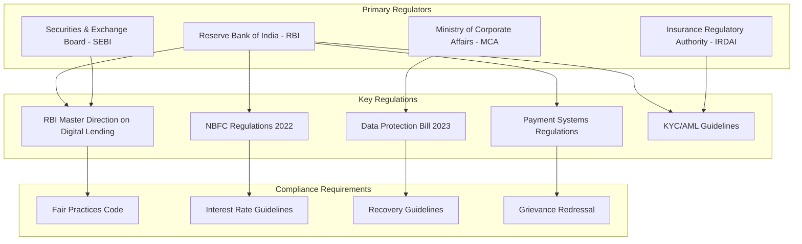

---

## 📊 **INDIAN LENDING SECTORS & MARKET DYNAMICS**

### **1. Personal Loans (₹8 lakh crore market)**
**Target Segments**: Salaried class, self-employed professionals  
**Key Players**: HDFC Bank, ICICI, Bajaj Finserv, PaySense  
**Average Ticket Size**: ₹2-15 lakhs  
**Interest Rates**: 10.5%-24% p.a.  

**Indian-Specific Requirements**:
- PAN card mandatory verification
- Aadhaar-based eKYC
- GST returns for self-employed
- Bank statement analysis (6-12 months)
- Employer verification through EPF/ESI

**Data Sources**:
- CIBIL/Experian/Equifax/CRIF High Mark
- Income Tax Department APIs
- EPF Organization database
- Bank statement APIs (Account Aggregator)
- GST Network (GSTN) data

### **2. Home Loans (₹18 lakh crore market)**
**Target Segments**: First-time buyers, upgraders, investors  
**Key Players**: HDFC Ltd, SBI, ICICI Bank, LIC Housing  
**Average Ticket Size**: ₹25-75 lakhs  
**Interest Rates**: 8.5%-12% p.a.  

**Indian-Specific Requirements**:
- Property title verification
- RERA registration check
- Stamp duty and registration
- Home insurance mandatory
- Technical and legal evaluation

**Data Sources**:
- Sub-registrar office records
- RERA database
- Property valuation APIs
- Municipal corporation data
- Insurance company networks

### **3. Vehicle Loans (₹4.5 lakh crore market)**
**Target Segments**: Two-wheeler, car, commercial vehicle buyers  
**Key Players**: HDFC Bank, Bajaj Auto Finance, Mahindra Finance  
**Average Ticket Size**: ₹50K-20 lakhs  
**Interest Rates**: 9%-16% p.a.  

**Indian-Specific Requirements**:
- Vehicle RC verification
- Dealer invoice validation
- Insurance coverage mandatory
- Hypothecation with RTO
- Fastag integration

**Data Sources**:
- RTO databases (state-wise)
- Vehicle manufacturer APIs
- Insurance databases
- Fastag transaction data
- Used vehicle valuation services

### **4. MSME/Business Loans (₹12 lakh crore market)**
**Target Segments**: Small businesses, manufacturers, traders  
**Key Players**: SBI, HDFC Bank, IndusInd Bank, Lendingkart  
**Average Ticket Size**: ₹5 lakhs-2 crores  
**Interest Rates**: 12%-28% p.a.  

**Indian-Specific Requirements**:
- MSME registration certificate
- GST returns (3+ years)
- ITR filings verification
- Bank statement analysis
- Business premises verification

**Data Sources**:
- MSME Ministry database
- GST Network (GSTN)
- Ministry of Corporate Affairs
- TReDS platform data
- Industry association databases

### **5. Gold Loans (₹3.5 lakh crore market)**
**Target Segments**: Rural population, small businesses  
**Key Players**: Muthoot Finance, Manappuram, IIFL Finance  
**Average Ticket Size**: ₹25K-5 lakhs  
**Interest Rates**: 12%-20% p.a.  

**Indian-Specific Requirements**:
- Gold purity testing (BIS hallmark)
- Market rate verification
- Secure storage facilities
- Insurance coverage
- RBI LTV ratio compliance (75%)

**Data Sources**:
- Multi Commodity Exchange (MCX) gold rates
- BIS hallmarking database
- Insurance valuation services
- Precious metals market data
- Regional gold rate APIs

### **6. Education Loans (₹1.2 lakh crore market)**
**Target Segments**: Higher education, professional courses  
**Key Players**: SBI, Canara Bank, HDFC Credila, Avanse  
**Average Ticket Size**: ₹5-50 lakhs  
**Interest Rates**: 9%-15% p.a.  

**Indian-Specific Requirements**:
- University/college approval
- Course fee structure validation
- Academic records verification
- Co-applicant income proof
- Collateral evaluation (>₹7.5 lakhs)

**Data Sources**:
- UGC approved institutions list
- AICTE/MCI/BCI databases
- University APIs for verification
- Scholarship databases
- International education consultants

### **7. Agricultural Loans (₹15 lakh crore market)**
**Target Segments**: Farmers, agribusiness, food processing  
**Key Players**: SBI, Punjab National Bank, NABARD  
**Average Ticket Size**: ₹50K-50 lakhs  
**Interest Rates**: 7%-12% p.a. (subsidized)  

**Indian-Specific Requirements**:
- Land ownership records
- Crop insurance verification
- Kisan Credit Card linkage
- Soil health card data
- Weather data integration

**Data Sources**:
- Land Records (Revenue Department)
- NABARD databases
- India Meteorological Department
- Agriculture Insurance Company
- Minimum Support Price data
- Kisan Credit Card data

### **8. Microfinance (₹3 lakh crore market)**
**Target Segments**: Rural women, urban poor, small entrepreneurs  
**Key Players**: Bandhan Bank, Ujjivan, SKS Microfinance  
**Average Ticket Size**: ₹15K-1 lakh  
**Interest Rates**: 18%-26% p.a.  

**Indian-Specific Requirements**:
- Self-Help Group verification
- Joint liability group formation
- Weekly/monthly collection model
- Financial literacy certification
- Aadhaar-based payments

**Data Sources**:
- National Rural Livelihoods Mission
- Self-Help Group databases
- Jan Dhan account data
- MUDRA scheme data
- Aadhaar Enabled Payment System

### **9. Credit Cards (₹1.8 lakh crore market)**
**Target Segments**: Urban salaried, professionals, businesses  
**Key Players**: HDFC Bank, SBI Cards, ICICI Bank, Axis Bank  
**Average Limit**: ₹50K-10 lakhs  
**Interest Rates**: 36%-42% p.a.  

**Indian-Specific Requirements**:
- Income proof mandatory
- CIBIL score minimum 750
- Employment verification
- Existing relationship preferred
- Spend pattern analysis

**Data Sources**:
- Credit bureau real-time data
- Merchant category classification
- Payment gateway transaction data
- UPI transaction patterns
- E-commerce spending data

### **10. Two-Wheeler Loans (₹85,000 crore market)**
**Target Segments**: Young professionals, students, rural customers  
**Key Players**: Bajaj Auto Finance, TVS Credit, Hero FinCorp  
**Average Ticket Size**: ₹60K-2 lakhs  
**Interest Rates**: 11%-18% p.a.  

**Indian-Specific Requirements**:
- Minimal documentation
- Quick approval (same day)
- Dealer tie-up mandatory
- Insurance bundling
- Flexible EMI options

**Data Sources**:
- Automobile manufacturer data
- Dealer network databases
- Insurance company APIs
- RTO registration data
- Fuel efficiency databases

### **11. Healthcare Loans (₹25,000 crore market)**
**Target Segments**: Medical emergencies, elective procedures  
**Key Players**: Bajaj Finserv Health, MobiKwik, PaySense  
**Average Ticket Size**: ₹25K-10 lakhs  
**Interest Rates**: 14%-24% p.a.  

**Indian-Specific Requirements**:
- Hospital/doctor empanelment
- Treatment estimate validation
- Insurance claim coordination
- Medical necessity certificate
- No-cost EMI options

**Data Sources**:
- Hospital network databases
- Doctor registration councils
- Treatment cost benchmarks
- Insurance company networks
- Medical equipment financing data

### **12. Digital/Fintech Loans (₹75,000 crore market)**
**Target Segments**: Digital-first customers, gig workers  
**Key Players**: Payme India, CASHe, KreditBee, MoneyTap  
**Average Ticket Size**: ₹5K-5 lakhs  
**Interest Rates**: 18%-36% p.a.  

**Indian-Specific Requirements**:
- Mobile-first experience
- Alternative credit scoring
- UPI payment integration
- Digital documentation
- Instant disbursal

**Data Sources**:
- UPI transaction history
- Mobile wallet data
- E-commerce transaction patterns
- Social media financial behavior
- Telecom payment history
- Utility bill payment patterns

---

## 🗃️ **COMPREHENSIVE INDIAN DATASET REQUIREMENTS**

### **Core National Datasets**

#### **1. Credit Bureau Integration (Real-time APIs)**
**Sources**: CIBIL, Experian, Equifax, CRIF High Mark  
**Coverage**: 600 million+ individuals, 10 million+ businesses  
**Update Frequency**: Real-time

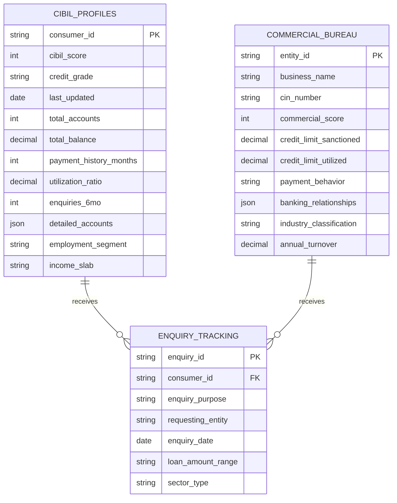

#### **2. Government & Regulatory Datasets**

**RBI Economic Data (50GB+ Real-time)**
- Repo rates, bank rates, CRR/SLR
- Sectoral deployment of credit
- Priority sector lending data
- NPA statistics by sector
- Foreign exchange rates

**Income Tax Department (API Integration)**
- PAN verification
- ITR filing status
- TDS certificates
- Form 26AS data
- Tax compliance scores

**GST Network - GSTN (Real-time)**
- GST registration verification
- Monthly/quarterly returns
- Input tax credit utilization
- Turnover declarations
- Compliance ratings

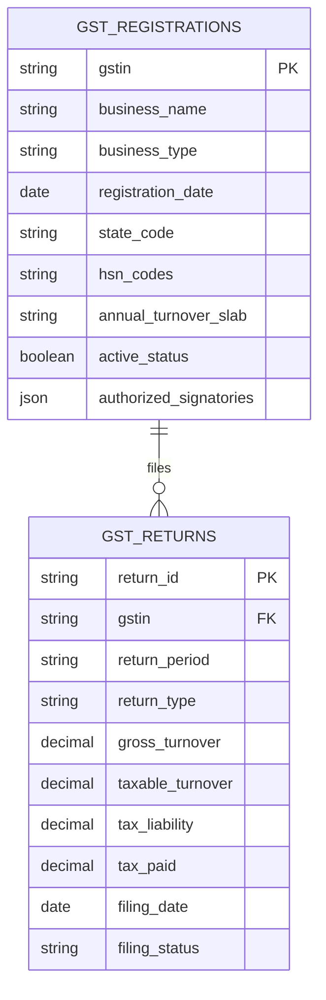

#### **3. Banking & Financial Infrastructure**

**Account Aggregator Framework**
- Bank statement data (consented)
- Investment portfolio information
- Insurance policy details
- Pension fund contributions
- Mutual fund holdings

**UPI Transaction Analytics (Big Data)**
- Transaction patterns and frequency
- Merchant category spending
- Peer-to-peer payment behavior
- Seasonal spending variations
- Geographic transaction patterns

**NACH/ECS Mandate Data**
- Existing EMI obligations
- Utility payment patterns
- Systematic investment patterns
- Insurance premium payments
- Subscription payment behavior

### **Sector-Specific Indian Datasets**

#### **Agriculture Sector (15GB+)**
**Sources**: NABARD, Ministry of Agriculture, IMD, APMC

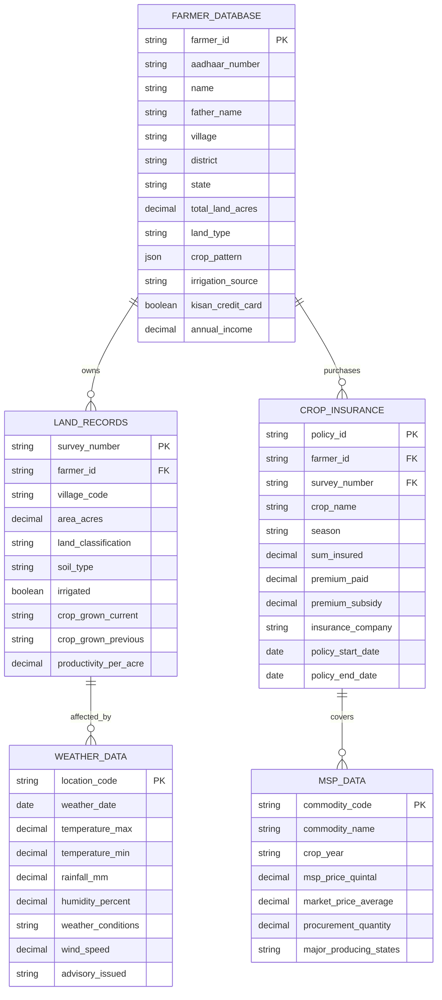

**Key Agricultural Data Points**:
- 146 million agricultural holdings
- 2000+ APMC markets
- 500+ commodities tracked
- Weather data from 6000+ stations
- Soil health data from 22 crore samples

#### **MSME/Business Sector (25GB+)**
**Sources**: MCA, MSME Ministry, Industry Associations

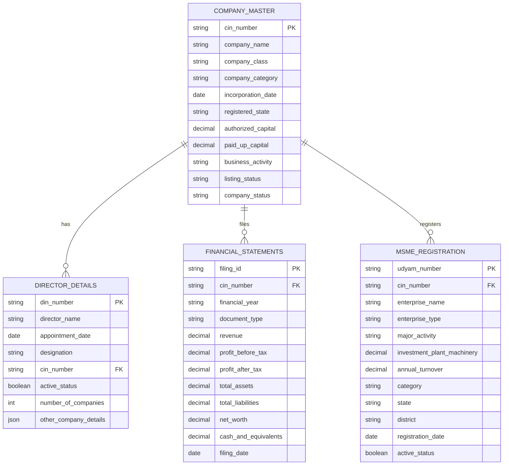

#### **Real Estate Sector (10GB+)**
**Sources**: RERA Authorities, Sub-registrar Offices, Municipal Corporations

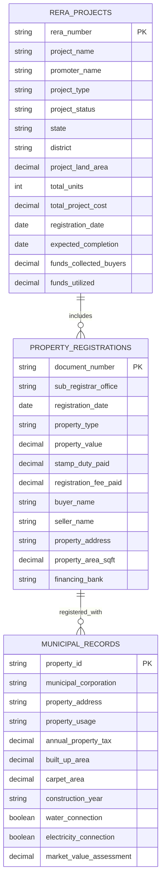

#### **Healthcare Sector (5GB+)**
**Sources**: Medical Councils, IRDAI, Hospital Networks

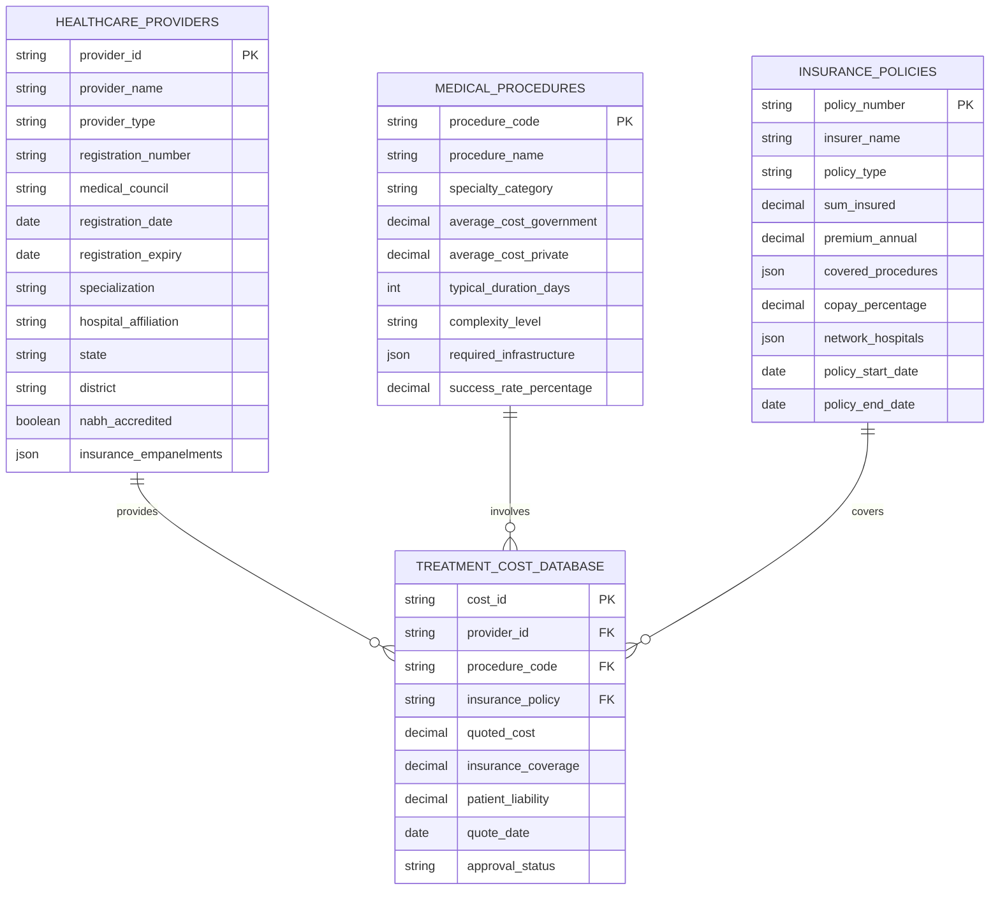

---

## 🏗️ **SYSTEM ARCHITECTURE - INDIA EDITION**

### **Cloud Infrastructure Strategy**

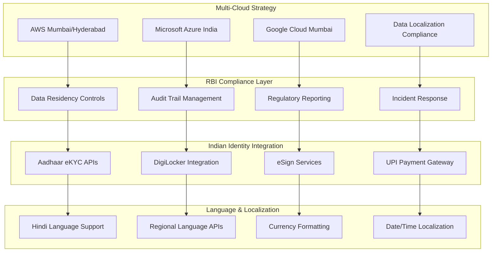

### **Indian Compliance Architecture**

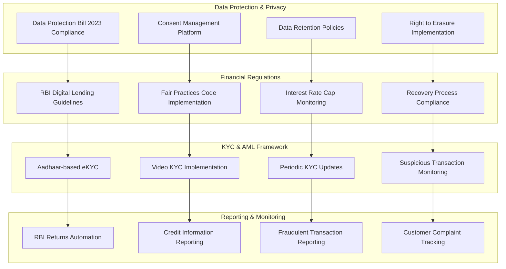

### **AI Model Stack - Indian Context**

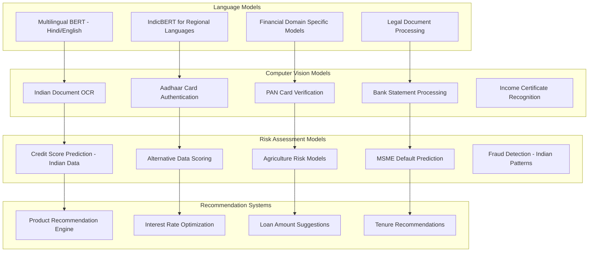

---

## 📱 **TECHNOLOGY STACK - INDIA OPTIMIZED**

### **Frontend Development**
**Web Application**:
```typescript
// India-specific configuration
interface IndiaConfig {
  languages: ['hi', 'en', 'ta', 'te', 'bn', 'gu', 'mr', 'kn'];
  currency: 'INR';
  dateFormat: 'DD/MM/YYYY';
  phoneFormat: '+91-XXXXX-XXXXX';
  addressFormat: IndianAddressFormat;
  paymentMethods: ['UPI', 'NetBanking', 'Cards', 'Wallets'];
  kycMethods: ['Aadhaar', 'PAN', 'Passport', 'VoterID'];
}

// Vernacular language support
const languageSupport = {
  hindi: 'हिंदी भाषा समर्थन',
  tamil: 'தமிழ் மொழி ஆதரவு',
  telugu: 'తెలుగు భాష మద్దతు',
  bengali: 'বাংলা ভাষা সহায়তা',
  gujarati: 'ગુજરાતી ભાષા સહાય',
  marathi: 'मराठी भाषा समर्थन',
  kannada: 'ಕನ್ನಡ ಭಾಷಾ ಬೆಂಬಲ'
};
```

**Mobile Application (React Native)**:
- **Aadhaar Integration**: UIDAI eKYC SDK
- **UPI Payments**: PhonePe/GPay/Paytm integration
- **Offline Functionality**: Rural connectivity support
- **Voice Input**: Hindi voice recognition
- **Regional Scripts**: Devanagari, Tamil, Telugu support

### **Backend Architecture**
**Microservices Stack**:
```yaml
services:
  - name: aadhaar-verification-service
    technology: Node.js/Express
    database: PostgreSQL
    external_apis: [UIDAI, DigiLocker]
    
  - name: credit-bureau-integration
    technology: Java Spring Boot
    database: MongoDB
    external_apis: [CIBIL, Experian, Equifax]
    
  - name: gst-verification-service
    technology: Python FastAPI
    database: Redis Cache
    external_apis: [GSTN APIs]
    
  - name: banking-integration
    technology: Node.js
    database: PostgreSQL
    external_apis: [Account Aggregator]
    
  - name: risk-assessment-engine
    technology: Python ML
    database: TimeSeries DB
    ml_models: [XGBoost, TensorFlow]
```

### **Database Strategy**
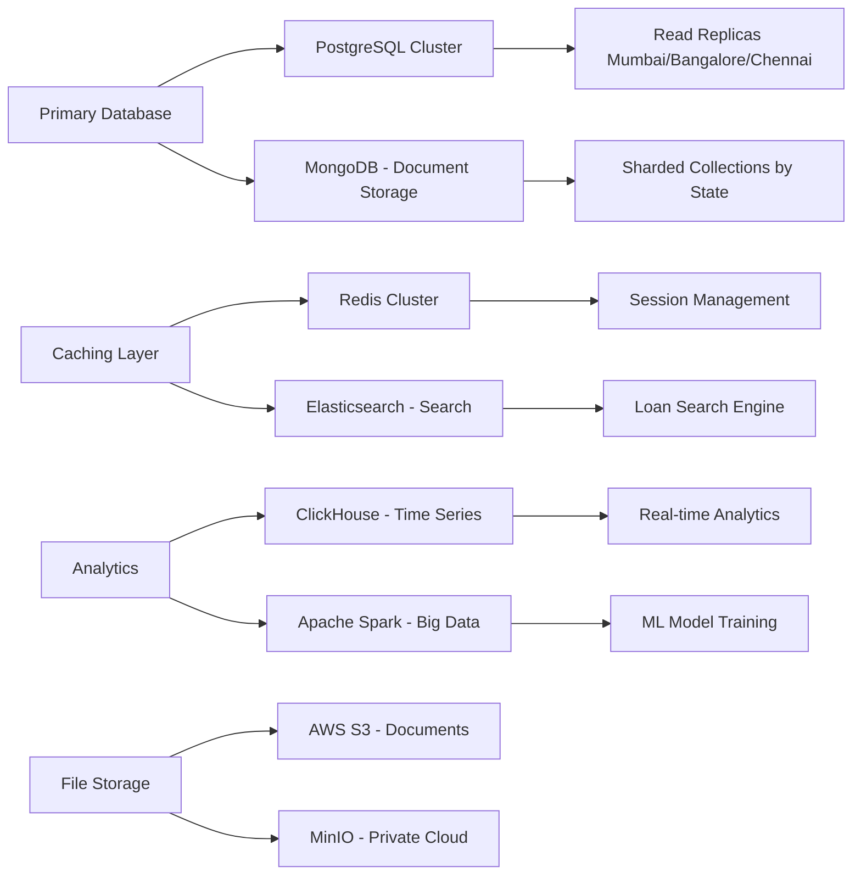

---

## 🚀 **COMPLETE PROJECT IMPLEMENTATION PLAN**

### **Phase 1: Foundation & Compliance (Months 1-6)**

#### **Month 1-2: Legal & Regulatory Setup**
**Objectives**:
- Entity incorporation and licensing
- Regulatory compliance framework
- Legal documentation preparation

**Deliverables**:
- NBFC registration with RBI
- Data Protection Officer appointment
- Privacy policy and terms of service
- Fair practices code documentation
- Grievance redressal mechanism setup

**Budget**: ₹25 lakhs
**Team**: Legal (2), Compliance (2), Business (1)

#### **Month 3-4: Core Infrastructure Setup**
**Objectives**:
- Cloud infrastructure deployment
- Security framework implementation
- Basic platform development

**Deliverables**:
- Multi-cloud setup (AWS/Azure/GCP)
- Security and encryption implementation
- CI/CD pipeline establishment
- Monitoring and logging systems
- Backup and disaster recovery setup

**Budget**: ₹50 lakhs
**Team**: DevOps (4), Security (2), Backend (3)

#### **Month 5-6: Identity & KYC Systems**
**Objectives**:
- Indian identity verification systems
- KYC/AML framework implementation
- Government API integrations

**Deliverables**:
- Aadhaar eKYC integration
- PAN verification system
- DigiLocker integration
- Video KYC implementation
- eSign services integration

**Budget**: ₹35 lakhs
**Team**: Backend (4), Integration (2), Security (2)

### **Phase 2: Core Platform Development (Months 7-12)**

#### **Month 7-8: Credit Bureau & Data Integration**
**Objectives**:
- Credit bureau API integrations
- Data aggregation platform development
- Real-time data processing systems

**Deliverables**:
- CIBIL/Experian/Equifax integration
- Account Aggregator implementation
- GST data integration
- Banking data aggregation
- Real-time data processing pipeline

**Budget**: ₹60 lakhs
**Team**: Backend (5), Data Engineering (3), Integration (2)

#### **Month 9-10: AI/ML Model Development**
**Objectives**:
- Risk assessment model development
- Credit scoring algorithms
- Fraud detection systems

**Deliverables**:
- Credit scoring models for each sector
- Alternative data scoring algorithms
- Fraud detection and prevention
- Risk assessment automation
- Model validation and testing

**Budget**: ₹80 lakhs
**Team**: ML Engineers (5), Data Scientists (4), Backend (3)

#### **Month 11-12: Sector-Specific Modules**
**Objectives**:
- Individual lending sector implementation
- Specialized workflows development
- Sector-specific risk models

**Deliverables**:
- Personal loans module
- Home loans module with RERA integration
- Vehicle loans with RTO integration
- Basic business loans functionality
- Education loans module

**Budget**: ₹75 lakhs
**Team**: Full Stack (8), Product (2), QA (4)

### **Phase 3: Advanced Features & Expansion (Months 13-18)**

#### **Month 13-14: Advanced AI & Automation**
**Objectives**:
- Advanced AI model deployment
- Automated decision making systems
- Predictive analytics implementation

**Deliverables**:
- Real-time credit decisioning (90% automation)
- Predictive risk models for each sector
- Automated document processing (OCR + NLP)
- Chatbot with multilingual support
- Advanced fraud detection with behavioral analytics

**Budget**: ₹90 lakhs
**Team**: ML Engineers (6), AI Specialists (3), Backend (4)

#### **Month 15-16: Mobile & Regional Expansion**
**Objectives**:
- Mobile application development
- Regional language support
- Rural market penetration features

**Deliverables**:
- Android/iOS native applications
- Progressive Web App (PWA)
- Hindi + 6 regional languages support
- Offline capability for rural areas
- Voice-based loan applications
- SMS-based loan tracking

**Budget**: ₹65 lakhs
**Team**: Mobile Developers (6), UI/UX (3), Localization (2)

#### **Month 17-18: Specialized Sectors Implementation**
**Objectives**:
- Niche lending sectors development
- Advanced sector-specific features
- Agricultural and MSME focus

**Deliverables**:
- Agricultural loans with satellite imagery
- MSME loans with GST analytics
- Gold loans with real-time pricing
- Healthcare loans with hospital networks
- Microfinance with SHG integration
- Credit cards with spending analytics

**Budget**: ₹85 lakhs
**Team**: Full Stack (10), Domain Experts (4), QA (5)

### **Phase 4: Scale & Optimization (Months 19-24)**

#### **Month 19-20: Performance & Scale Optimization**
**Objectives**:
- System performance optimization
- Scalability enhancements
- Load testing and optimization

**Deliverables**:
- Auto-scaling infrastructure
- Database optimization and sharding
- CDN implementation for fast loading
- Load balancing across regions
- Performance monitoring dashboards
- 99.9% uptime achievement

**Budget**: ₹45 lakhs
**Team**: DevOps (5), Performance Engineers (3), Backend (4)

#### **Month 21-22: Advanced Analytics & Business Intelligence**
**Objectives**:
- Business intelligence platform
- Advanced analytics dashboard
- Regulatory reporting automation

**Deliverables**:
- Real-time business intelligence dashboard
- Automated regulatory reporting to RBI
- Portfolio risk management system
- Customer behavior analytics
- Market trend analysis tools
- Predictive business insights

**Budget**: ₹55 lakhs
**Team**: Data Engineers (4), BI Developers (3), Analysts (3)

#### **Month 23-24: Market Launch Preparation**
**Objectives**:
- Production deployment
- Security audits and certifications
- Go-to-market strategy implementation

**Deliverables**:
- Production environment setup
- Security certifications (ISO 27001, SOC 2)
- Penetration testing and vulnerability assessments
- User acceptance testing with pilot customers
- Marketing automation setup
- Customer support system implementation

**Budget**: ₹40 lakhs
**Team**: DevOps (3), Security (3), QA (4), Marketing (2), Support (3)

---

## 💰 **DETAILED BUDGET BREAKDOWN**

### **Development Costs (24 Months)**

| Phase | Duration | Budget (₹ Lakhs) | Key Deliverables |
|-------|----------|------------------|------------------|
| Foundation & Compliance | 6 months | 110 | Legal setup, Infrastructure, KYC systems |
| Core Platform | 6 months | 215 | Credit bureau integration, AI models, Basic sectors |
| Advanced Features | 6 months | 240 | Advanced AI, Mobile apps, Specialized sectors |
| Scale & Optimization | 6 months | 140 | Performance optimization, BI, Production launch |
| **Total Development** | **24 months** | **₹7.05 Crores** | **Complete Platform** |

### **Infrastructure Costs (Annual)**

| Component | Annual Cost (₹ Lakhs) | Description |
|-----------|------------------------|-------------|
| Cloud Infrastructure | 45 | AWS/Azure multi-region setup |
| Third-party APIs | 35 | Credit bureau, Government APIs |
| Software Licenses | 25 | Development tools, monitoring |
| Security & Compliance | 20 | Security tools, audits, certifications |
| Data Storage & Backup | 15 | Database hosting, backup solutions |
| **Total Infrastructure** | **₹1.40 Crores** | **Annual recurring costs** |

### **Operational Costs (Annual)**

| Department | Team Size | Annual Cost (₹ Lakhs) |
|------------|-----------|------------------------|
| Technology (Salaries) | 25 people | 300 |
| Product & Design | 5 people | 75 |
| Marketing & Sales | 8 people | 80 |
| Legal & Compliance | 4 people | 60 |
| Customer Support | 6 people | 36 |
| Operations & Admin | 4 people | 40 |
| **Total Operational** | **52 people** | **₹5.91 Crores** |

### **Total Investment Summary**
- **Development (24 months)**: ₹7.05 Crores
- **Infrastructure (Annual)**: ₹1.40 Crores
- **Operations (Annual)**: ₹5.91 Crores
- **Marketing & Customer Acquisition**: ₹2 Crores
- **Working Capital & Contingency**: ₹3 Crores
- **Total Initial Investment**: ₹19.36 Crores

---

## 👥 **DETAILED TEAM STRUCTURE & HIRING PLAN**

### **Technology Team (25 Members)**

#### **Backend Development (8 Members)**
**Senior Backend Architects (2)**:
- Experience: 8-12 years
- Skills: Microservices, System Design, Indian Financial APIs
- Salary: ₹35-50 LPA each
- Responsibilities: Architecture design, API integrations, Performance optimization

**Backend Developers (6)**:
- Experience: 3-7 years  
- Skills: Node.js/Java/Python, Databases, API development
- Salary: ₹18-35 LPA each
- Responsibilities: Feature development, API integrations, Data processing

#### **AI/ML Team (6 Members)**
**ML Architects (2)**:
- Experience: 6-10 years
- Skills: ML model design, Credit scoring, Indian financial data
- Salary: ₹40-60 LPA each
- Responsibilities: Model architecture, Risk assessment algorithms

**Data Scientists (2)**:
- Experience: 4-8 years
- Skills: Statistical analysis, Predictive modeling, Alternative data
- Salary: ₹25-45 LPA each
- Responsibilities: Data analysis, Model development, Business insights

**ML Engineers (2)**:
- Experience: 3-6 years
- Skills: MLOps, Model deployment, Monitoring
- Salary: ₹20-35 LPA each
- Responsibilities: Model deployment, Performance monitoring, A/B testing

#### **Frontend Team (5 Members)**
**Frontend Architect (1)**:
- Experience: 7-10 years
- Skills: React/Angular, Mobile development, UI/UX
- Salary: ₹30-45 LPA
- Responsibilities: Frontend architecture, Mobile app design

**Full-Stack Developers (3)**:
- Experience: 3-7 years
- Skills: React, Node.js, Mobile development
- Salary: ₹18-30 LPA each
- Responsibilities: Web application, Mobile apps, Integration

**Mobile Developer (1)**:
- Experience: 4-6 years
- Skills: React Native/Flutter, iOS/Android native
- Salary: ₹20-35 LPA
- Responsibilities: Mobile application development, Platform-specific features

#### **DevOps & Infrastructure (3 Members)**
**DevOps Architect (1)**:
- Experience: 6-9 years
- Skills: AWS/Azure, Kubernetes, Security
- Salary: ₹35-50 LPA
- Responsibilities: Infrastructure design, Security implementation

**DevOps Engineers (2)**:
- Experience: 3-6 years
- Skills: CI/CD, Monitoring, Cloud platforms
- Salary: ₹18-30 LPA each
- Responsibilities: Deployment automation, Monitoring, Maintenance

#### **QA & Testing (3 Members)**
**QA Lead (1)**:
- Experience: 5-8 years
- Skills: Test automation, Security testing, Financial domain
- Salary: ₹25-40 LPA
- Responsibilities: Testing strategy, Quality assurance

**QA Engineers (2)**:
- Experience: 2-5 years
- Skills: Manual testing, Automation, API testing
- Salary: ₹12-25 LPA each
- Responsibilities: Testing execution, Bug reporting, Test automation

### **Product & Business Team (17 Members)**

#### **Product Management (3 Members)**
**Chief Product Officer**:
- Experience: 10-15 years
- Skills: Fintech products, Indian lending market
- Salary: ₹60-80 LPA
- Responsibilities: Product strategy, Roadmap, Market analysis

**Product Managers (2)**:
- Experience: 5-8 years
- Skills: Product development, User research, Financial products
- Salary: ₹30-50 LPA each
- Responsibilities: Feature definition, User stories, Product analytics

#### **Design Team (2 Members)**
**UX/UI Designer (1)**:
- Experience: 4-7 years
- Skills: User experience design, Prototyping, Financial interfaces
- Salary: ₹20-35 LPA
- Responsibilities: User interface design, User experience optimization

**Visual Designer (1)**:
- Experience: 3-5 years
- Skills: Visual design, Brand identity, Marketing materials
- Salary: ₹15-25 LPA
- Responsibilities: Visual identity, Marketing design, Brand consistency

#### **Legal & Compliance (4 Members)**
**Chief Compliance Officer**:
- Experience: 8-12 years
- Skills: RBI regulations, NBFC compliance, Financial law
- Salary: ₹50-70 LPA
- Responsibilities: Regulatory compliance, Legal strategy

**Compliance Managers (2)**:
- Experience: 4-7 years
- Skills: KYC/AML, Regulatory reporting, Financial compliance
- Salary: ₹25-40 LPA each
- Responsibilities: Compliance monitoring, Reporting, Audits

**Legal Counsel (1)**:
- Experience: 5-8 years
- Skills: Corporate law, Contract negotiation, Financial regulations
- Salary: ₹30-45 LPA
- Responsibilities: Legal documentation, Contract management

#### **Marketing & Sales (8 Members)**
**Chief Marketing Officer**:
- Experience: 8-12 years
- Skills: Digital marketing, Fintech marketing, Indian market
- Salary: ₹40-60 LPA
- Responsibilities: Marketing strategy, Brand building, Customer acquisition

**Digital Marketing Managers (2)**:
- Experience: 4-7 years
- Skills: Performance marketing, SEO/SEM, Social media
- Salary: ₹15-30 LPA each
- Responsibilities: Digital campaigns, Lead generation, Analytics

**Sales Managers (3)**:
- Experience: 3-6 years
- Skills: B2B sales, Partnership development, Relationship management
- Salary: ₹12-25 LPA each
- Responsibilities: Partner onboarding, Sales execution, Relationship management

**Content Specialists (2)**:
- Experience: 2-5 years
- Skills: Content creation, Copywriting, Financial content
- Salary: ₹8-18 LPA each
- Responsibilities: Content marketing, Social media, Documentation

### **Operations Team (10 Members)**

#### **Customer Support (6 Members)**
**Customer Support Manager (1)**:
- Experience: 5-8 years
- Skills: Customer service, Team management, Financial services
- Salary: ₹20-35 LPA
- Responsibilities: Support strategy, Team management, Escalations

**Customer Support Representatives (5)**:
- Experience: 1-4 years
- Skills: Customer service, Multi-language support, Problem resolution
- Salary: ₹6-15 LPA each
- Responsibilities: Customer queries, Issue resolution, Documentation

#### **Operations (4 Members)**
**Operations Manager (1)**:
- Experience: 6-9 years
- Skills: Process optimization, Team management, Analytics
- Salary: ₹25-40 LPA
- Responsibilities: Operations strategy, Process improvement

**Business Analysts (2)**:
- Experience: 3-6 years
- Skills: Data analysis, Process design, Financial modeling
- Salary: ₹15-30 LPA each
- Responsibilities: Business analysis, Process documentation, Reporting

**Administrative Assistant (1)**:
- Experience: 2-4 years
- Skills: Administration, Office management, Coordination
- Salary: ₹8-15 LPA
- Responsibilities: Administrative support, Office coordination

---

## 🎯 **GO-TO-MARKET STRATEGY**

### **Phase 1: Soft Launch (Months 19-21)**

#### **Target Markets**:
1. **Metro Cities**: Mumbai, Delhi, Bangalore, Chennai, Hyderabad
2. **Tier-1 Cities**: Pune, Kolkata, Ahmedabad, Surat, Jaipur
3. **Focus Segments**: Salaried professionals, Small businesses, Tech-savvy users

#### **Launch Strategy**:
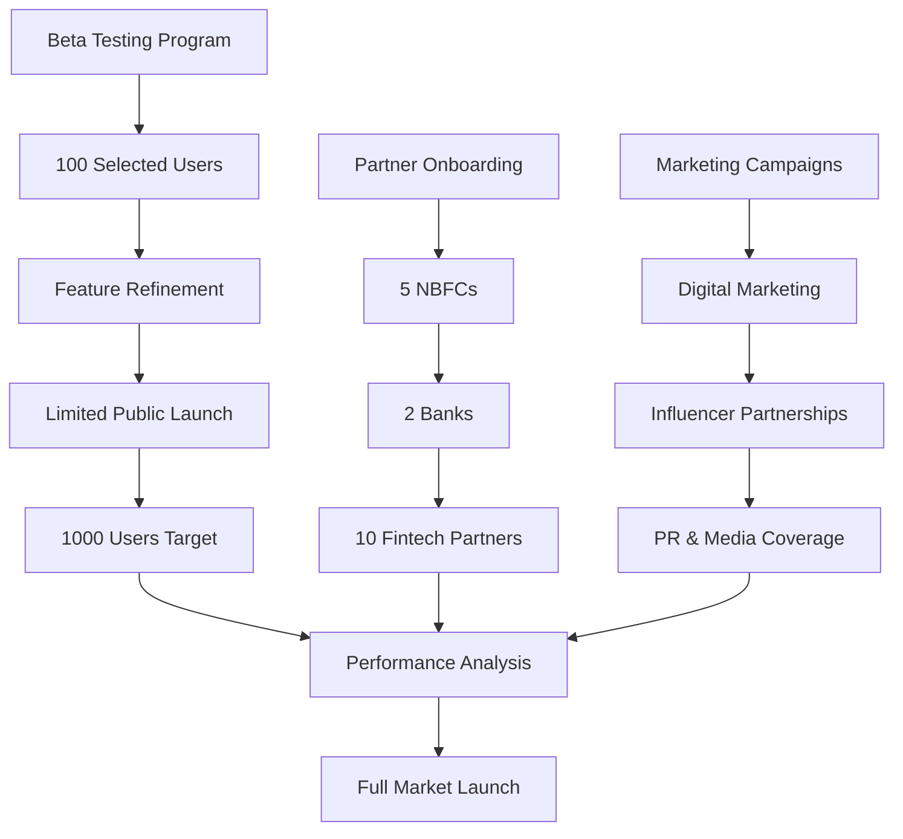

#### **Marketing Channels**:
- **Digital Marketing**: Google Ads, Facebook, LinkedIn (Budget: ₹25 lakhs)
- **Content Marketing**: Blog, YouTube, Webinars (Budget: ₹10 lakhs)
- **Partnerships**: Fintech companies, Chartered Accountants (Budget: ₹15 lakhs)
- **PR & Media**: Financial publications, Tech media (Budget: ₹10 lakhs)

### **Phase 2: Market Expansion (Months 22-24)**

#### **Expanded Markets**:
1. **Tier-2 Cities**: 50 cities with >5 lakh population
2. **Rural Areas**: Agricultural loan focus in 10 states
3. **Specialized Segments**: Healthcare, Education, Green energy loans

#### **Growth Strategy**:
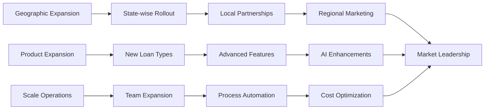

#### **Partnership Strategy**:
- **Banking Partners**: 10 public/private sector banks
- **NBFC Partners**: 25 NBFCs across sectors
- **Technology Partners**: Payment gateways, KYC providers
- **Distribution Partners**: Financial advisors, DSAs

### **Revenue Projections (3-Year)**

| Year | Loan Volume (₹ Crores) | Revenue (₹ Crores) | Growth Rate |
|------|------------------------|-------------------|-------------|
| Year 1 | 500 | 15 | - |
| Year 2 | 2,000 | 60 | 300% |
| Year 3 | 6,000 | 180 | 200% |

**Revenue Streams**:
- **Processing Fees**: 0.5-2% of loan amount
- **Platform Fees**: ₹500-5000 per successful loan
- **Subscription**: ₹10,000-50,000 monthly for lenders
- **Data Analytics**: ₹1-5 lakh monthly for insights
- **White-label Solutions**: ₹50 lakh-2 crore setup fee

---

## 🔐 **SECURITY & COMPLIANCE IMPLEMENTATION**

### **RBI Compliance Framework**

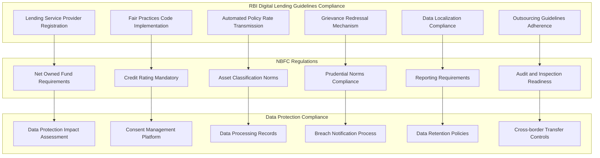

### **Security Architecture Implementation**

#### **Authentication & Access Control**
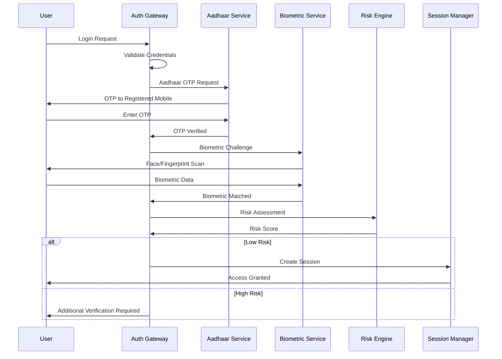

#### **Data Encryption Strategy**
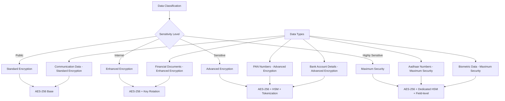

#### **Fraud Detection & Prevention**
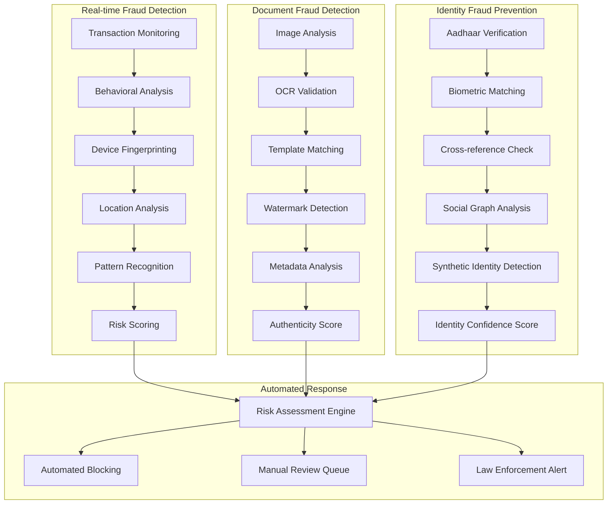

---

## 📊 **MONITORING & ANALYTICS FRAMEWORK**

### **Business Intelligence Dashboard**

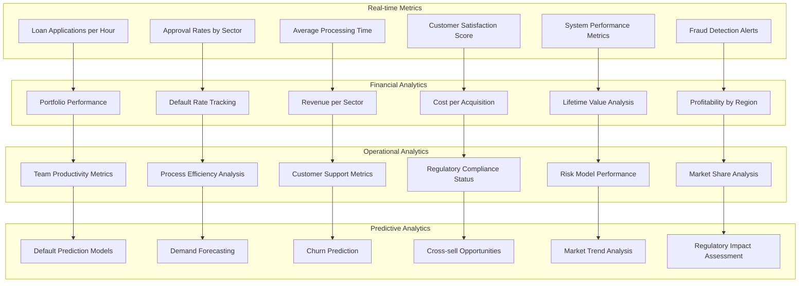

### **Key Performance Indicators (KPIs)**

#### **Business KPIs**
- **Application Volume**: Target 10,000 applications/month by Month 24
- **Approval Rate**: 65-75% across all sectors
- **Processing Time**: <24 hours for 80% of applications
- **Customer Satisfaction**: >4.5/5.0 rating
- **Default Rate**: <3% for personal loans, <2% for secured loans

#### **Technical KPIs**
- **System Uptime**: 99.9% availability
- **API Response Time**: <500ms for 95% of requests
- **Data Accuracy**: >99.5% for all verification processes
- **Security Incidents**: Zero major security breaches
- **Fraud Detection Rate**: >95% accuracy with <2% false positives

#### **Financial KPIs**
- **Revenue Growth**: 200%+ year-over-year
- **Customer Acquisition Cost**: <₹500 per customer
- **Lifetime Value**: >₹5,000 per customer
- **Operating Margin**: 25%+ by Year 2
- **Return on Investment**: 35%+ by Year 3

---

## 🚀 **DEPLOYMENT STRATEGY**

### **Production Environment Setup**

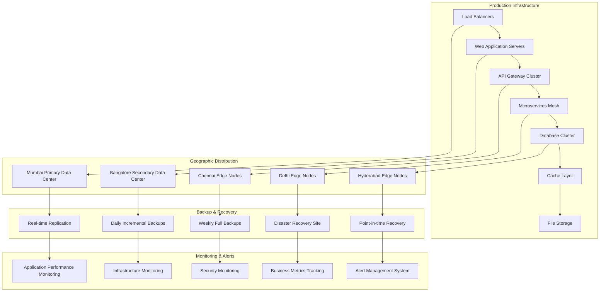

### **Deployment Pipeline**

```mermaid
graph LR
    A[Code Commit] --> B[Automated Testing]
    B --> C[Security Scanning]
    C --> D[Code Quality Check]
    D --> E[Build & Package]
    E --> F[Deploy to Staging]
    F --> G[Integration Testing]
    G --> H[Performance Testing]
    H --> I[Security Testing]
    I --> J[User Acceptance Testing]
    J --> K[Deploy to Production]
    K --> L[Smoke Testing]
    L --> M[Monitoring & Alerts]
    M --> N[Rollback if Issues]
```

### **Launch Checklist**

#### **Pre-Launch (30 days before)**
- [ ] Security penetration testing completed
- [ ] Load testing with 10x expected traffic
- [ ] Disaster recovery procedures tested
- [ ] Customer support team trained
- [ ] Legal documentation finalized
- [ ] Regulatory approvals obtained
- [ ] Marketing campaigns prepared
- [ ] Partner integrations tested

#### **Launch Day**
- [ ] Production deployment completed
- [ ] All systems monitoring active
- [ ] Customer support team on standby
- [ ] Marketing campaigns activated
- [ ] Press release distributed
- [ ] Social media campaigns launched
- [ ] Partner notifications sent
- [ ] Internal team briefed

#### **Post-Launch (30 days after)**
- [ ] Daily system health reviews
- [ ] Customer feedback analysis
- [ ] Performance metrics monitoring
- [ ] Bug fixes and improvements deployed
- [ ] Customer support metrics reviewed
- [ ] Marketing campaign performance analyzed
- [ ] Partner feedback incorporated
- [ ] Regulatory compliance verified

---

## 📈 **SUCCESS METRICS & MILESTONES**

### **12-Month Milestones**

| Milestone | Target Date | Success Criteria |
|-----------|-------------|------------------|
| MVP Launch | Month 12 | Core platform with 3 loan sectors operational |
| First 100 Customers | Month 13 | Successful loan processing for 100 customers |
| Break-even Point | Month 18 | Monthly revenue covers operational costs |
| 10,000 Applications | Month 20 | Processing 10,000+ applications monthly |
| Series A Funding | Month 21 | Raise ₹50 crores Series A funding |
| Market Leadership | Month 24 | Top 3 position in Indian digital lending |

### **Long-term Vision (3-5 Years)**

#### **Market Position Goals**:
- **Market Share**: 5-8% of Indian digital lending market
- **Customer Base**: 1 million+ registered users
- **Geographic Coverage**: Operations in 500+ cities
- **Loan Volume**: ₹10,000+ crores annually
- **Valuation**: ₹2,000+ crores company valuation

#### **Product Innovation Goals**:
- **AI Leadership**: Industry-leading credit scoring accuracy
- **Technology Innovation**: Blockchain-based loan agreements
- **Financial Inclusion**: 100,000+ first-time borrowers served
- **Sustainability**: Carbon-neutral operations by 2027
- **International Expansion**: Operations in 2+ South Asian countries

This comprehensive plan provides a complete roadmap for building and launching Fin-Agentix in the Indian market, with detailed implementation strategies, team structures, budgets, and success metrics tailored specifically for the Indian financial services landscape.