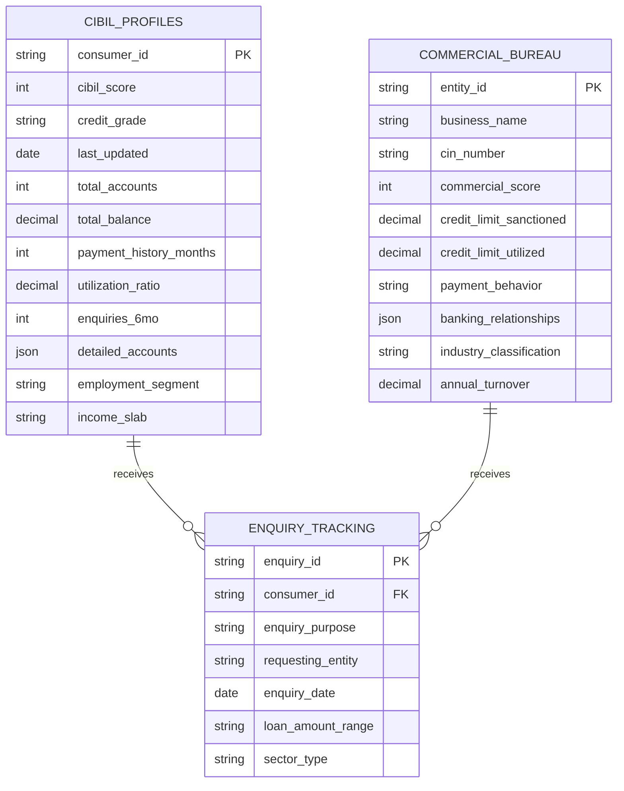
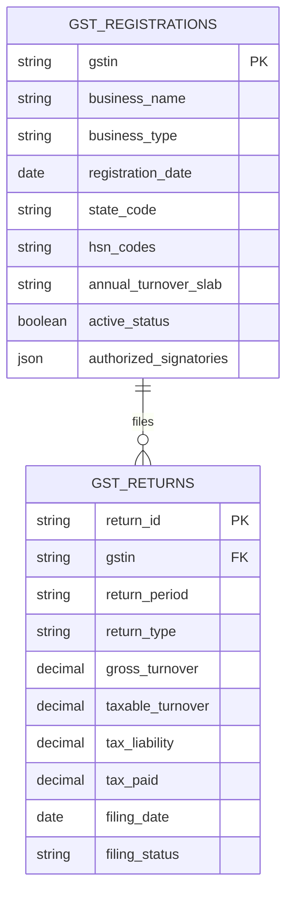
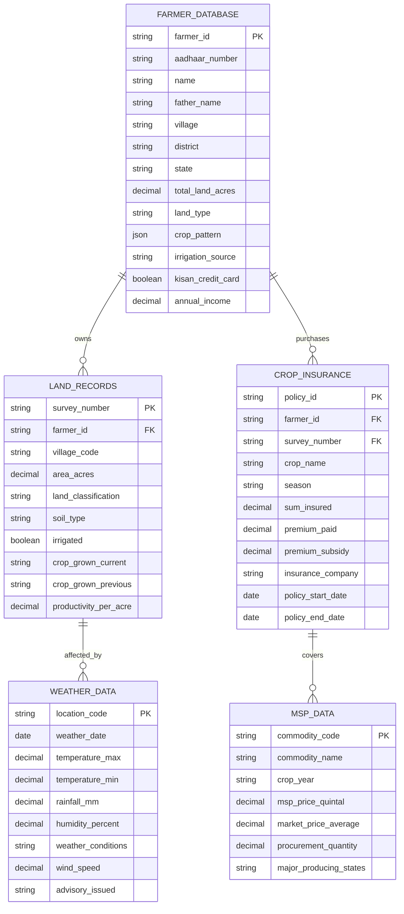
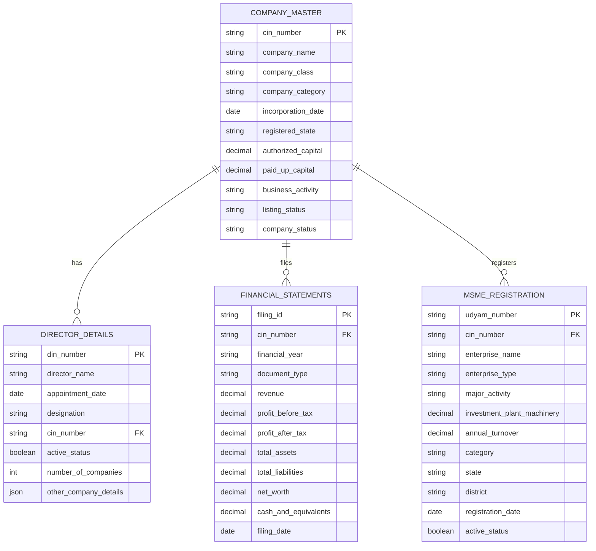
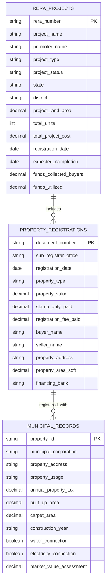
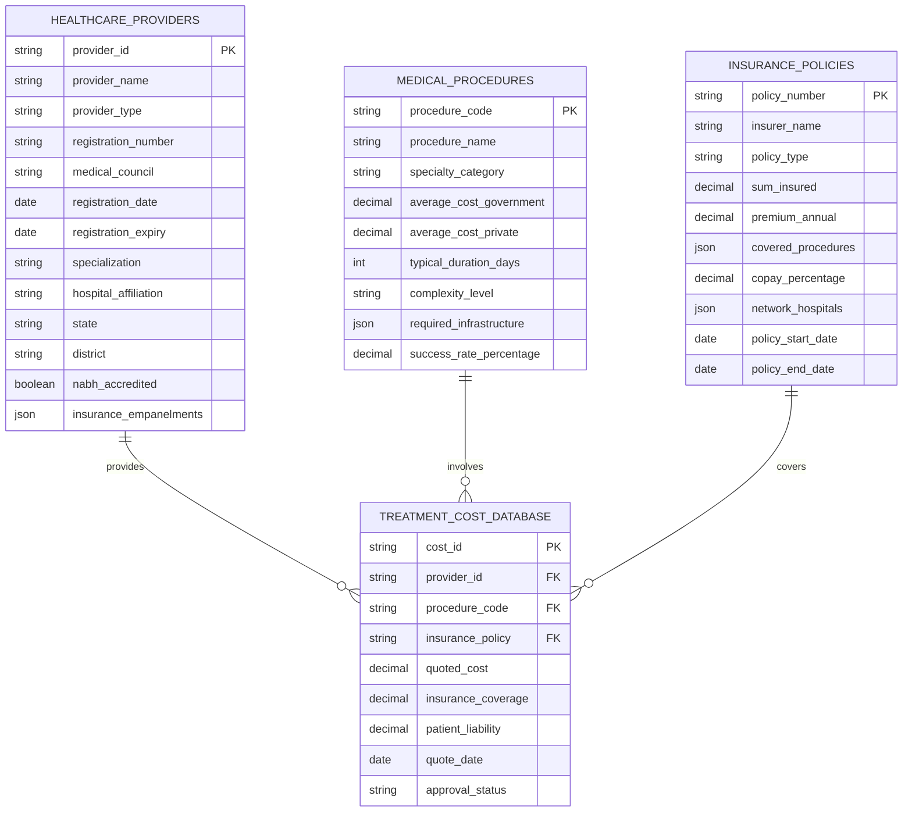

# Database Schema

This document outlines the database schema for the Fin-Agentix India platform. The schema is designed to be scalable, secure, and compliant with Indian financial regulations.

## Credit Bureau Integration

## Government & Regulatory Datasets

## Sector-Specific Datasets

### Agriculture Sector

### MSME/Business Sector

### Real Estate Sector

### Healthcare Sector

