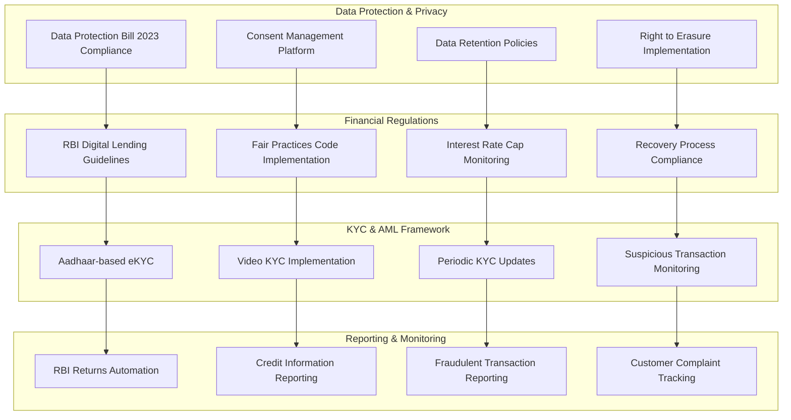

# Regulatory Compliance Framework

Fin-Agentix India is committed to upholding the highest standards of regulatory compliance. Our platform is designed to be fully compliant with all applicable Indian financial regulations, including those set forth by the Reserve Bank of India (RBI), the Securities and Exchange Board of India (SEBI), and other regulatory bodies.

## RBI Compliance

Our platform adheres to all RBI guidelines for digital lending, including:

*   **Fair Practices Code**: We are committed to fair and transparent lending practices, including clear communication of all loan terms and conditions.
*   **Data Localization**: All sensitive customer data is stored in data centers located within India.
*   **Grievance Redressal**: We have a robust grievance redressal mechanism to address any customer complaints or concerns in a timely and effective manner.
*   **NBFC Registration**: We are in the process of obtaining our own NBFC license to ensure full compliance with all regulatory requirements.

## Data Protection and Privacy

We are fully compliant with the Data Protection Bill 2023. Our data protection framework includes:

*   **Consent Management**: We obtain explicit consent from users before collecting or processing their data.
*   **Data Encryption**: All sensitive data is encrypted at rest and in transit.
*   **Data Minimization**: We only collect the data that is necessary to provide our services.
*   **Right to Erasure**: Users have the right to request the erasure of their personal data.

## KYC and AML Framework

We have a robust Know Your Customer (KYC) and Anti-Money Laundering (AML) framework in place, which includes:

*   **Aadhaar-based eKYC**: We use Aadhaar for instant and secure identity verification.
*   **Video KYC**: For high-value loans, we conduct video KYC sessions to further verify the identity of the borrower.
*   **Periodic KYC Updates**: We periodically update the KYC information of our users to ensure it is current and accurate.
*   **Suspicious Transaction Monitoring**: We have systems in place to monitor for and report any suspicious transactions to the relevant authorities.

