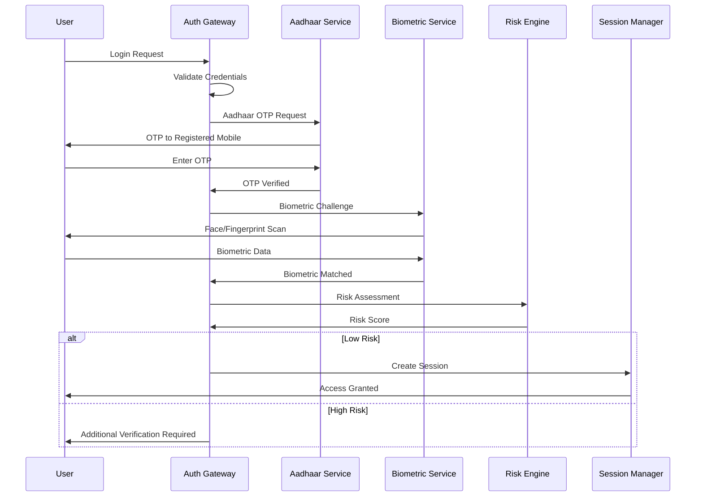

# Authentication and Access Control

Fin-Agentix India employs a robust, multi-layered authentication and access control framework to ensure the highest level of security, in compliance with RBI guidelines and international standards.

## Authentication Strategy

Our strategy is centered around a Zero-Trust Architecture, meaning no user or service is trusted by default. Every access request is authenticated and authorized.

### User Authentication

1.  **Password-Based Login**: The initial login requires a strong, complex password that is securely hashed and salted.
2.  **Multi-Factor Authentication (MFA)**: All user accounts are protected by MFA. This includes:
    *   **OTP (One-Time Password)**: Sent to the user's registered mobile number.
    *   **Biometric Verification**: For mobile app users, leveraging fingerprint or facial recognition.
3.  **Aadhaar-Based Authentication**: For critical operations, users can authenticate using Aadhaar OTP, providing a high level of identity assurance.

### API Authentication

*   **JWT (JSON Web Tokens)**: All API endpoints are secured using JWT. After a successful login, the client receives a short-lived, signed JWT, which must be included in the header of all subsequent requests.
*   **API Keys**: For service-to-service communication, we use securely managed API keys with IP whitelisting.

## Access Control

We implement a strict Role-Based Access Control (RBAC) model to ensure that users can only access the information and perform the actions necessary for their roles.

### User Roles

*   **Borrower**: Can view their own loan applications, KYC status, and profile information.
*   **Lender (Admin)**: Can view and manage loan applications assigned to them, but cannot see applications from other lenders.
*   **Platform Administrator**: Has access to system-wide settings, user management, and security configurations.
*   **Compliance Officer**: Has read-only access to all data for auditing and regulatory purposes.

### Access Control Flowchart

