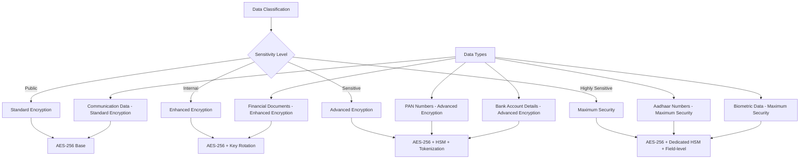

# Data Encryption Strategy

Data encryption is a fundamental component of the Fin-Agentix India security strategy. We employ a multi-layered encryption approach to protect data both at rest and in transit, ensuring compliance with the Data Protection Bill 2023 and RBI guidelines.

## Encryption at Rest

All sensitive data stored on our servers is encrypted at rest using the AES-256 standard. This includes data in databases, file storage, and backups.

### Data Classification and Encryption Levels

We classify data into different sensitivity levels, each with a corresponding level of encryption:

*   **Public**: Standard Encryption (AES-256)
*   **Internal**: Enhanced Encryption (AES-256 with key rotation)
*   **Sensitive**: Advanced Encryption (AES-256 with HSM and tokenization). This includes PAN numbers and bank account details.
*   **Highly Sensitive**: Maximum Security (AES-256 with a dedicated HSM and field-level encryption). This applies to Aadhaar numbers and biometric data.

## Encryption in Transit

All data transmitted between the user's device and our servers, as well as between our internal services, is encrypted using TLS 1.3, the latest and most secure version of the Transport Layer Security protocol.

## Key Management

*   **Hardware Security Modules (HSMs)**: We use FIPS 140-2 Level 3 certified HSMs to manage our encryption keys, ensuring they are stored in a secure, tamper-proof environment.
*   **Key Rotation**: All encryption keys are automatically rotated on a regular basis to minimize the risk of key compromise.