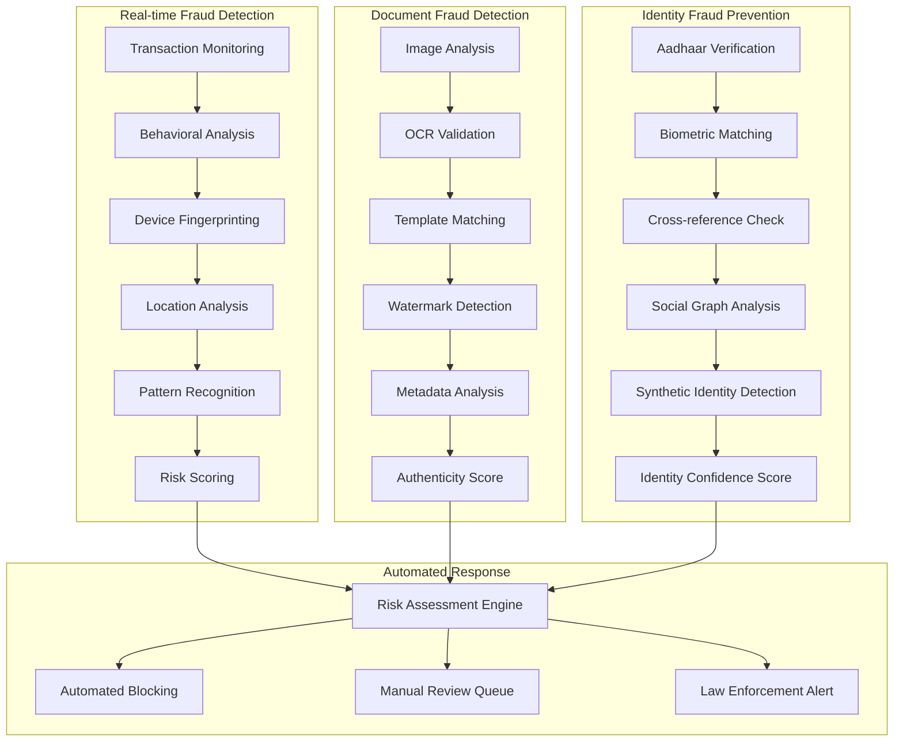

# Fraud Detection and Prevention

Fin-Agentix India has implemented a sophisticated, multi-layered fraud detection and prevention system. This system is designed to proactively identify and mitigate fraudulent activities in real-time, protecting both our users and our lending partners.

## Real-time Fraud Detection

Our real-time fraud detection engine analyzes every transaction and application, looking for suspicious patterns and anomalies. This includes:

*   **Transaction Monitoring**: Continuously monitoring for unusual transaction amounts, frequencies, and locations.
*   **Behavioral Analysis**: Creating a baseline of normal user behavior and flagging any deviations.
*   **Device Fingerprinting**: Identifying and tracking the devices used to access our platform to detect account takeovers.
*   **Location Analysis**: Using geolocation data to identify suspicious or impossible travel patterns.
*   **Pattern Recognition**: Using machine learning to identify known fraud patterns and adapt to new ones.

## Document Fraud Detection

We use a combination of AI and computer vision to detect fraudulent documents:

*   **Image Analysis**: Analyzing the quality and consistency of uploaded documents.
*   **OCR Validation**: Extracting text from documents and cross-verifying it with other data sources.
*   **Template Matching**: Comparing uploaded documents to known templates of genuine documents.
*   **Watermark Detection**: Identifying and verifying digital and physical watermarks.
*   **Metadata Analysis**: Analyzing the metadata of digital documents for signs of tampering.

## Identity Fraud Prevention

*   **Aadhaar Verification**: Using Aadhaar OTP and biometric verification to ensure the authenticity of user identities.
*   **Biometric Matching**: Matching live selfies and videos with the user's Aadhaar photograph.
*   **Cross-reference Check**: Verifying user information across multiple databases, including credit bureaus, government records, and social media.
*   **Synthetic Identity Detection**: Using advanced analytics to detect and flag synthetic identities.

## Automated Response

When a high-risk activity is detected, our system takes immediate action:

*   **Automated Blocking**: High-risk transactions are automatically blocked.
*   **Manual Review Queue**: Suspicious applications and transactions are sent to a dedicated fraud review team.
*   **Law Enforcement Alert**: In cases of confirmed fraud, we cooperate fully with law enforcement agencies.

